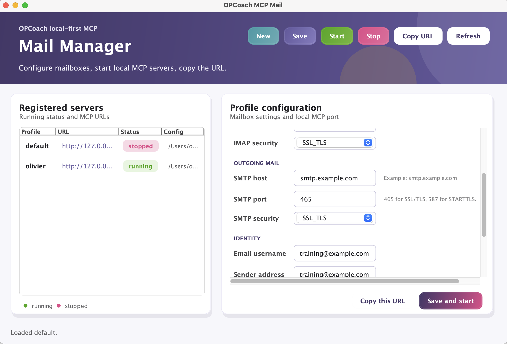

# opcoach-mcp-mail

[](#security)
[](#requirements)
[](#local-build)

Local-first MCP server for accessing a generic IMAP/SMTP mailbox from Codex, Claude Code Pro, Claude Desktop, or any MCP-compatible client.

The server does not depend on Gmail, Microsoft 365, or any proprietary OAuth flow. It runs on your machine or on a server you control. The email password is never sent to the AI model.

## Requirements

- An email account compatible with IMAP and SMTP
- An app password if your provider requires one
- Java JDK 24 or newer

Maven is not required: the repository includes the Maven Wrapper.

## Install Java On Windows

If `java -version` fails, install Eclipse Temurin JDK 24 with the Windows x64 MSI installer:

```text
https://api.adoptium.net/v3/installer/latest/24/ga/windows/x64/jdk/hotspot/normal/eclipse?project=jdk
```

Install the JDK, not only the JRE. After installation, close and reopen the terminal, then check:

```cmd
java -version
javac -version
```

Both commands should report version 24 or newer.

## Local Build

On Windows Command Prompt:

```cmd
git clone https://github.com/opcoach/opcoach-mcp-mail.git
cd opcoach-mcp-mail
mvnw.cmd clean verify
mvnw.cmd -DskipTests package
java -jar target\opcoach-mcp-mail.jar web-manager
```

On macOS or Linux:

```bash
git clone https://github.com/opcoach/opcoach-mcp-mail.git
cd opcoach-mcp-mail
./mvnw clean verify
./mvnw -DskipTests package
bin/web-manager
```

The standard build is non-interactive and uses only fake mail servers for tests.

## Web Manager

The web manager is the recommended local workflow. It starts a browser UI on `127.0.0.1` with a temporary token in the URL. It lets you create mailbox profiles, edit IMAP/SMTP settings, start or stop each local MCP endpoint, copy the MCP URL, and safely export or import profile settings.

The web manager and all MCP endpoints run in one Java process. Starting several mailbox profiles from the web manager does not create one JVM per mailbox.

Start it on macOS or Linux:

```bash
bin/web-manager
```

Start it on Windows after the build:

```cmd
java -jar target\opcoach-mcp-mail.jar web-manager
```

The printed URL looks like:

```text
http://127.0.0.1:18100/?token=temporary-token
```

Keep this URL local. Do not publish it on a public domain. It is intended for the current machine, or for a private SSH tunnel to a server you control.

In the web manager, use `Save and start` when a profile is ready, then `Copy MCP URL` to configure the AI client:

```text
http://127.0.0.1:8095/mcp
```

The `Mail check` column tests each profile in the background when the web manager opens and after a server starts. It checks the local MCP health endpoint when the server is running, verifies IMAP access, reads the `INBOX` message count, and confirms that the configured Sent and Trash folders exist.

Import/export is intentionally non-secret. Exported files contain profile names, local MCP ports, IMAP/SMTP hosts, security modes, usernames, sender identity, Reply-To, Sent folder, and Trash folder. They never contain mailbox passwords, vault passwords, bearer tokens, or stored local credentials. During import, profiles that already exist locally are unchecked by default; new profiles are checked by default. Imported profiles still require entering the mailbox password locally before use.

## Desktop Manager

The Swing desktop manager is kept temporarily while the web manager becomes the main UI.



The desktop manager lets you create mailbox profiles, edit IMAP/SMTP settings, start or stop each local MCP server, and copy the MCP URL to paste into Codex or another MCP client.

The left panel lists registered profiles with their local URL and running status. The right panel edits the selected profile: incoming mail, outgoing mail, identity, optional Reply-To address, local host, and local port. Use `Save and start` when the profile is ready, then `Copy URL` to configure the AI client.
When Reply-To is empty, sent emails do not include a `Reply-To` header.
The `Mail check` column validates the mailbox configuration in the background: MCP health when the server is running, IMAP access, `INBOX` message count, and existence of the configured Sent and Trash folders. Port conflicts with other registered profiles are rejected before saving.

Main actions:

- `New`: create a new mailbox profile.
- `Save`: save the selected profile without starting it.
- `Start`: start the selected local MCP server.
- `Stop`: stop the selected local MCP server.
- `Delete`: stop the selected local MCP server if needed, then remove its local registration, configuration, and stored password when supported after confirmation.
- `Copy URL`: copy the local MCP endpoint.
- `Refresh`: reload server status.

At the end, copy the URL into Codex, for example:

```text
http://127.0.0.1:8095/mcp
```

In Codex, choose:

```text
Mode: HTTP streamable / HTTP diffusable
URL:  http://127.0.0.1:8095/mcp
Credentials: empty
Headers: empty
```

Do not configure Codex with the jar in this local workflow. The manager starts the jar; Codex only connects to the local HTTP URL.

## Multiple Mailboxes

Create one profile per mailbox in the web manager or desktop manager. Each profile can use a different local port:

```text
Mailbox 1 -> http://127.0.0.1:8095/mcp
Mailbox 2 -> http://127.0.0.1:8096/mcp
```

The manager keeps configuration and runtime files separate by profile under:

```text
~/.opcoach-mcp-mail/
```

It also registers each local HTTP server under:

```text
~/.opcoach-mcp-mail/servers/
```

After rebooting the machine, start the web manager and every registered MCP endpoint in one Java process with:

```bash
bin/start-all
```

Passwords are not written to configuration files. On macOS, they are stored in the local keychain with the profile name. On Linux, they are stored in a local encrypted vault protected by a vault password. On other platforms, use `MAIL_MCP_PASSWORD` temporarily.

## Headless Linux Server

Do not expose a public setup URL such as `mcp-mail.example.com` for entering mailbox passwords. On a headless server, keep the web manager bound to `127.0.0.1` and reach it through an SSH tunnel.

From your workstation, open a tunnel to the server:

```bash
ssh -L 18100:127.0.0.1:18100 user@contabo-server
```

In that SSH session, build the jar and start the web manager on the tunneled port:

```bash
cd $HOME/git/opcoach-mcp-mail
./mvnw -DskipTests package

bin/web-manager --port 18100 --no-open
```

Then open the printed URL on your workstation:

```text
http://127.0.0.1:18100/?token=the-token-printed-by-the-command
```

On Linux, the form includes a `Vault password` field. This password protects the local encrypted vault:

```text
~/.opcoach-mcp-mail/secrets.enc
```

The vault stores mailbox passwords encrypted with AES-GCM. The encryption key is derived from the vault password with PBKDF2-HMAC-SHA256. The vault file is restricted to the local user when the filesystem supports POSIX permissions.

After saving a profile, use `Save and start` in the web manager. The generated MCP URL remains local to the server, for example `http://127.0.0.1:8096/mcp`.

If the encrypted vault exists, `bin/start-server` asks for the vault password and sends it to Java through standard input at startup. It is not put on the command line.

After rebooting the server, restart the web manager and every registered profile in one Java process with:

```bash
bin/start-all
```

`bin/start-all` asks once for the vault password when needed, starts the web manager, and starts all registered local MCP endpoints in that same process.

## Script Reference

Main local workflow:

```bash
bin/web-manager
```

Temporary desktop workflow:

```bash
bin/manager
```

Manual helpers:

```bash
bin/web-manager --port 18100
bin/setup-ui --profile default --port 18100
bin/manager
bin/start-server --profile default --port 8095
bin/start-all
bin/stop-server
```

`bin/web-manager --start-registered --no-open` starts the web manager and every registered MCP endpoint in one Java process.

`bin/start-server` is kept for direct single-profile HTTP use. It runs one standalone HTTP server on `127.0.0.1:8095` by default. It writes the PID file and logs under `.run/`, and builds `target/opcoach-mcp-mail.jar` automatically if it is missing.

`bin/start-all` is a convenience wrapper around `bin/web-manager --start-registered --no-open`. It stays in the foreground because the single Java process owns both the web manager and the registered MCP endpoints.

## Advanced Jar Usage

Direct stdio mode is useful for clients that launch MCP servers themselves:

```bash
java -jar target/opcoach-mcp-mail.jar --stdio
```

Direct HTTP mode:

```bash
java -jar target/opcoach-mcp-mail.jar --http --port 8095
```

The HTTP server listens on `127.0.0.1` by default. If you listen on another interface, provide a token:

```bash
java -jar target/opcoach-mcp-mail.jar --http --host 0.0.0.0 --port 8095 --token "long-random-token"
```

For direct jar usage, the default non-secret configuration file is:

```text
~/.opcoach-mcp-mail/config.properties
```

The macOS keychain is supported for passwords. Linux uses the encrypted local vault. On other platforms, use `MAIL_MCP_PASSWORD` temporarily.

## Codex HTTP Configuration

Example:

```text
Name: OPCoach MCP Mail
Mode: HTTP streamable / HTTP diffusable
URL:  http://127.0.0.1:8095/mcp
Bearer token environment variable: empty
Headers: empty
```

## Claude HTTP Configuration

Example:

```text
Name: OPCoach MCP Mail
Mode: HTTP streamable
URL:  http://127.0.0.1:8095/mcp
Authentication: none for localhost
```

## Exposed Tools

- `sendEmail`: sends a text or HTML email with base64 attachments, then attempts to copy it to Sent.
- `listMailboxes`: lists the available IMAP folders.
- `searchMessages`: searches messages with text filters, inclusive received-date range (`since`/`until`), `limit`, and `beforeUid` cursor paging.
- `getMessage`: reads a specific message by UID.
- `getAttachment`: retrieves a small attachment inline as base64. This is intentionally limited to avoid large JSON responses.
- `getAttachmentInfo`: lists attachment metadata for one message without downloading contents.
- `saveAttachment`: saves one attachment directly on the MCP server disk without returning its contents in JSON.
- `moveMessage`: moves a message by UID from one IMAP folder to another.
- `deleteMessage`: moves a message by UID to the configured trash folder.

Searches return metadata, snippets, mailbox, and UID only. Use `getMessage` to inspect one selected message before calling `moveMessage` or `deleteMessage`.
To page through a date range safely, call `searchMessages` again with `beforeUid` set to the last UID returned by the previous page.
Date filters use the IMAP received date. `until` is inclusive for the whole calendar day.
Attachments are never downloaded automatically. Use `getAttachmentInfo` first, then `saveAttachment` for selected invoices or documents.
Deletion is intentionally non-destructive by default: messages are moved to `trash.mailbox`, not permanently expunged.

### Local Attachment Export

`saveAttachment` writes files under a local attachment root and never returns the file contents to the AI client. The default root is:

```text
~/.opcoach-mcp-mail/attachments/<profile>/
```

The tool accepts an optional relative `directory` below that root, for example `invoices/2026-01`, and an optional `filename`.
Absolute paths, Windows drive paths, backslashes, and `..` escapes are rejected. Existing files are not overwritten; a numeric suffix is added automatically.

For server deployments or tests, the root directory can be changed before starting the MCP server:

```bash
export MAIL_MCP_ATTACHMENT_DIR=/srv/opcoach-mcp-mail/attachments
```

or with the Java property:

```bash
java -Dmail.mcp.attachmentDir=/srv/opcoach-mcp-mail/attachments -jar target/opcoach-mcp-mail.jar --http
```

## Security

- No permanent destructive action in v1: `deleteMessage` moves messages to the configured trash folder.
- No unlimited bulk reads.
- Email bodies and attachment contents are not written to audit logs.
- Saved attachments stay on the MCP server filesystem under the configured attachment root.
- An email read by the AI remains untrusted external data.
- The AI client should request confirmation before any real send, according to its context.

## License

MIT.
